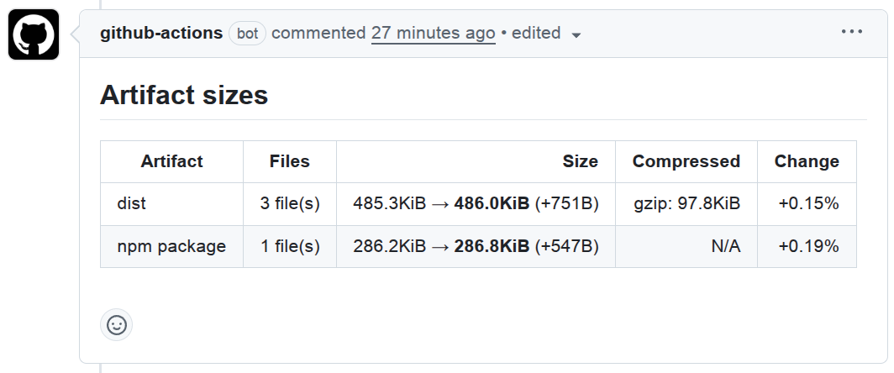

# pull-request-bundle-analyzer

A tool to analyze JavaScript bundle sizes and compare results between runs (e.g. between the default branch and a feature branch).



## Installation

Install the package via npm (recommended):

```bash
npm install -D pull-request-bundle-analyzer
```

## Using with Github Actions

The recommended pattern is three jobs:

- **Analyze (base)**: on the pull request target branch run the `analyze` action to produce a baseline.
- **Analyze (current)**: on the PR head ref, run the `analyze` action to bundle data for the current commit.
- **Compare**: run the `compare` action to compare the two bundles.

Example workflow::

```yaml
name: Bundle size

on:
  pull_request:
    types: [opened, synchronize, reopened]

jobs:
  analyze-base:
    name: Analyze (base)
    runs-on: ubuntu-latest
    steps:
      - name: Checkout target branch
        uses: actions/checkout@v6
        with:
          ref: ${{ github.event.pull_request.base.ref }}

      - name: Setup Node.js
        uses: actions/setup-node@v6

      - name: Install & build
        run: |
          npm ci
          npm run build

      - name: Run analyzer
        uses: ext/pull-request-bundle-analyzer/analyze
        with:
          config-file: ./example-config.json
          artifact-name: base-bundle

  analyze-current:
    name: Analyze (current)
    runs-on: ubuntu-latest
    needs: analyze-base
    steps:
      - name: Checkout head ref
        uses: actions/checkout@v6
        with:
          ref: ${{ github.event.pull_request.head.ref }}

      - name: Setup Node.js
        uses: actions/setup-node@v6

      - name: Install & build
        run: |
          npm ci
          npm run build

      - name: Run analyzer (current)
        uses: ext/pull-request-bundle-analyzer/analyze
        with:
          config-file: ./example-config.json
          artifact-name: current-bundle

  compare:
    name: Compare
    runs-on: ubuntu-latest
    needs: [analyze-base, analyze-current]
    steps:
      - name: Checkout repository
        uses: actions/checkout@v6

      - name: Setup Node.js
        uses: actions/setup-node@v6

      - name: Compare results
        id: compare
        uses: ext/pull-request-bundle-analyzer/compare
        with:
          base-artifact: base-bundle
          current-artifact: current-bundle

      - name: Print markdown
        run: |
          echo "Compare markdown output:"
          echo "========================"
          echo "${{ steps.compare.outputs.markdown }}"
```

> [!IMPORTANT]
> Both the `analyze` and `compare` actions assume you perform the `checkout` and `setup-node` steps in the workflow (shown above).

The output from the `compare` action can be used in a pull request comment, this example uses [`marocchino/sticky-pull-request-comment`](https://github.com/marocchino/sticky-pull-request-comment) but you can use any you like.

````yaml
- name: Post sticky PR comment
  uses: marocchino/sticky-pull-request-comment@v2
  with:
    header: pull-request-bundle-analyzer
    message: |
      ${{ steps.compare.outputs.markdown }}

      <details><summary>Raw JSON</summary>

      ```json
      ${{ steps.compare.outputs.json }}
      ```

      </details>
````

### Analyze action

| Input           | Required | Default                 | Description                                                                                                               |
| --------------- | -------: | ----------------------- | ------------------------------------------------------------------------------------------------------------------------- |
| `artifact-name` |      yes | —                       | Name for the uploaded artifact.                                                                                           |
| `config-file`   |      yes | —                       | Path to the bundle configuration file.                                                                                    |
| `output-file`   |       no | `temp/bundle-size.json` | Path to the output file produced by the analyzer.                                                                         |
| `version`       |       no | —                       | Optional npm package version (e.g. `1.2.3`). When provided, the action runs `npx pull-request-bundle-analyzer@<version>`. |

### Compare action

| Input              | Required | Default                 | Description                                                                                                               |
| ------------------ | -------: | ----------------------- | ------------------------------------------------------------------------------------------------------------------------- |
| `base-artifact`    |      yes | —                       | Artifact name for the base run (uploaded by `analyze`).                                                                   |
| `base-name`        |       no | `temp/bundle-size.json` | File name inside the base artifact that contains the analyzer output.                                                     |
| `current-artifact` |      yes | —                       | Artifact name for the current run (uploaded by `analyze`).                                                                |
| `current-name`     |       no | `temp/bundle-size.json` | File name inside the current artifact that contains the analyzer output.                                                  |
| `version`          |       no | —                       | Optional npm package version (e.g. `1.2.3`). When provided, the action runs `npx pull-request-bundle-analyzer@<version>`. |

| Output     | Description                                   | Example reference                       |
| ---------- | --------------------------------------------- | --------------------------------------- |
| `markdown` | The comparison result formatted as Markdown   | `${{ steps.compare.outputs.markdown }}` |
| `text`     | The comparison result formatted as plain text | `${{ steps.compare.outputs.text }}`     |
| `json`     | The comparison result formatted as JSON       | `${{ steps.compare.outputs.json }}`     |

## CLI usage

```bash
# Create a baseline (typically on the default branch)
npx pull-request-bundle-analyzer analyze -c example-config.json -f json -o temp/base.json

# Analyze current bundle(s) (typically on a feature branch)
npx pull-request-bundle-analyzer analyze -c example-config.json -f json -o temp/current.json

# Compare the two saved outputs
npx pull-request-bundle-analyzer compare --base temp/base.json --current temp/current.json
```

```bash
npx pull-request-bundle-analyzer <command> [options]
```

where `command` is one of:

- `analyze`: Analyze bundles defined in a config file.
- `compare`: Compare two previously saved analysis outputs.

### Analyze

Analyze bundles from a config file and print results or write to a file.

```bash
npx pull-request-bundle-analyzer analyze -c example-config.json
npx pull-request-bundle-analyzer analyze -c example-config.json -f json -o temp/base.json
```

Options:

- `-c, --config-file <path>`: Path to the config file (required)
- `-f, --format <text|json|markdown>`: Output format (default: `text`)
- `-o, --output-file <path>`: Write output to file instead of stdout

### Compare

Compare two saved results and print the diff.
The files should be the JSON outputs produced by `analyze -f json`.

```bash
npx pull-request-bundle-analyzer compare --base base.json --current current.json -f text
```

Options:

- `--base <path>`: Baseline JSON file produced by `analyze` (required)
- `--current <path>`: Current JSON file produced by `analyze` (required)
- `-f, --format <text|json|markdown>`: Output format (default: `text`)
- `-o, --output-file <path>`: Write output to file instead of stdout

### Configuration file

The config file describes bundles to analyze.

```json
{
  "bundles": [
    {
      "id": "app",
      "name": "app",
      "include": "dist/**/*.js"
    }
  ]
}
```

Each bundle has the following properties:

```ts
interface BundleConfig {
  id: string;
  name: string;
  include?: string | string[];
  exclude?: string | string[];
}
```

- `id`: Unique identifier for this bundle.
- `name`: The name of this bundle (displayed in the resulting reports)
- `include`: Files to include for this bundle (globs supported)
- `exclude`: Files to exclude for this bundle (globs supported)

## Development

Build the project locally:

```bash
npm install
npm run build
```

Run tests and linting during development:

```bash
npm test
npm run eslint
npm run prettier:check
```
